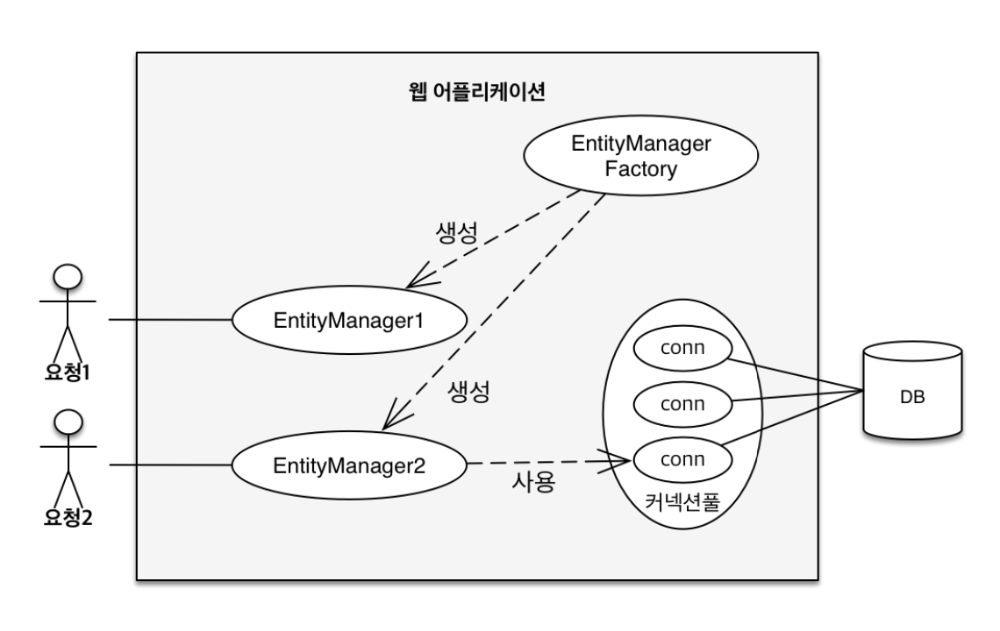
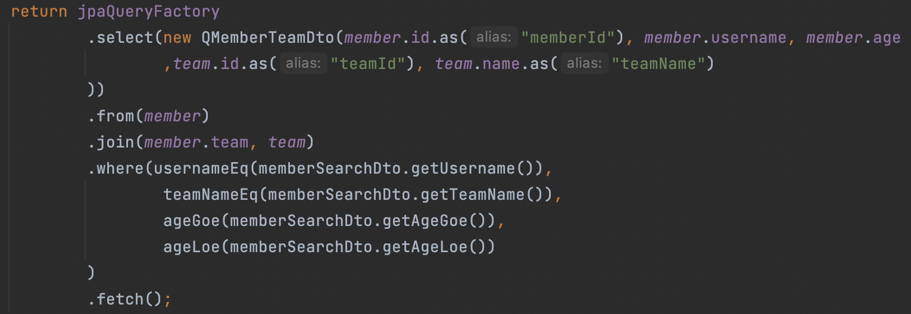
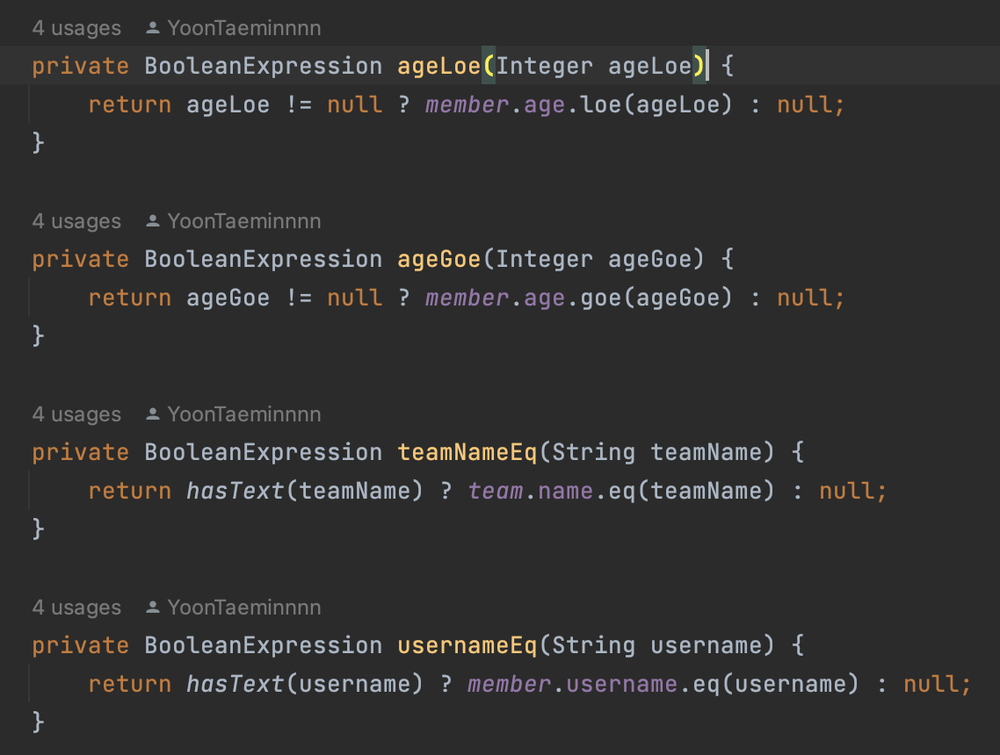

<aside>
💡 ORM은 무엇인가

스프링에서 대표적으로 사용하는 ORM은 무엇이 있고, 각각의 특징은 무엇이 있는가

JPA/ MyBatis를 사용해봤다면, 그 이유와 경험담 소개 ( 개인의 경험 공유 )

영속성이란 무엇인가

영속성 컨텍스트와 그 특징은 무엇이 있는가

트랜잭션은 무엇인가

</aside>

- **ORM은 무엇인가**
    
    기존의 sql중심적인 개발방식에서의 문제점은 객체와 관계형db와의 패러다임의 불일치에서 비롯된다. 객체가 가지고 있는 다양한 특성들(상속, 연관관계, 데이터타입 등등)과 db테이블의 특성과의 불일치를 개발자가 직접 해결해줘야 한다. 예를 들어 객체와 관계형db와의 sql 매핑 과정이 순수히 개발자의 몫이 된다. 뿐만 아니라 요구사항 변경에 굉장히 취약하다. 예를 들어 컬럼 속성이 하나라도 변경되어야 한다면, 객체와 수많은 쿼리문에 대한 수정이 필요해진다. 
    
    <aside>
    💡 * 상속관계 패러다임 불일치
          - 객체 → 자식객체는 부모객체에 대한 참조값을 가지고있을 필요X
          - 테이블 → 서브타입 테이블은 슈퍼타입 테이블에 대한 (PK,FK) 존재해야함
          - 조회 시, (슈퍼타입 테이블,서브타입 테이블)에 대한 조인쿼리문 직접 작성필요
    
    * 연관관계 패러다임 불일치
          연관객체 or 연관테이블에 대해…
          - 객체는 단방향으로만 접근 가능
          - 테이블은 양방향으로 접근 가능
    
    </aside>
    
    결국.. 객체답게 모델링 할수록 매핑작업만 늘어나는 현상이 발생한다…
    
    그렇다면! *객체를 자바 컬렉션에 저장하듯히 테이블에 저장할 수 없을까?*
    
    이러한 문제점을 해결하기 위해 나온 기술이 **ORM**(Object Relational Mapping) 이다. 객체와 테이블 간의 패러다임을 최대한 일치시키기 위해 나온 기술이라 볼 수 있다. 개발자는 객체는 객체대로 설계하고, 테이블은 테이블대로 설계한다. 그리고 ORM 프레임워크가 중간을 매핑해준다. 
    
- **스프링에서 대표적으로 사용하는 ORM은 무엇이 있고, 각각의 특징은 무엇이 있는가**
    
    대표적인 ORM기술은 JPA 이다. JPA는 ORM기술의 인터페이스의 모음(표준)이고, 구현체로 하이버네이트, EclipseLink, DataNucleus 가 있다.
    
    우선, JPA는 어플리케이션과 JDBC 사이에서 동작한다.
    
    
    
    JPA 동작 구조
    
    데이터 저장 시, 해당 객체 엔티티를 분석하고 그에 맞는 insert 쿼리문을 생성해서 JDBC api를 통해 db에 반영하게 된다. 조회 또한 요청에 맞는 select쿼리를 생성하여 JDBC api를 통해 db로부터 조회한 데이터를 객체와의 매핑작업을 수행해준다.
    
- **JPA/ MyBatis를 사용해봤다면, 그 이유와 경험담 소개 ( 개인의 경험 공유 )**
    
    김영한 강사님의 스프링강의를 수강하다가 JPA강의가 있는 것을 보고 단순하게 수강하기 시작했다. 이전에 순수 JDBC를 사용한 프로젝트 경험이 있었는데, JDBC만 사용했을 경우와 비교했을때 DAO(repository)를 작성하고 비즈니스 로직을 작성하는 것이 너무 편리해서 계속해서 수강하고 있는 중이다.
    
- **영속성이란 무엇인가**
    
    영속성(persistence)이란 사전적의미로 지속된다는 뜻으로, 데이터를 생성한 프로그램이 종료되더라도 사라지지 않는 데이터의 특성을 의미한다. 자세한 내용은 영속성 컨텍스트에서..
    
- **영속성 컨텍스트와 그 특징은 무엇이 있는가**
    
    JPA에서 가장 중요한 것 2가지를 뽑자면 앞서 말한 객체와 테이블간의 매핑과 영속성 컨텍스트에 대한 이해 이다. 영구적으로 저장된다는 의미의 영속성과 컨텍스트가 합쳐진 말로, **엔티티를 영구저장하는 환경**이라는 의미로 논리적인 개념이다.
    
    영속성 컨텍스트에 접근하기 위해서는 EntityManager가 필요하다. EntityManager는 고객의 요청에 따라 EntityManagerFactory에 의해 생성된다. 
    
    (여러 쓰레드가 하나의 entitymanager에 접근도 가능 → 트랜잭션 마다 별도의 영속성 컨텍스트를 제공 → 동시성 문제 x) → querydsl에서..
    
    
    
    EntityManager 생성 과정
    
    여기서 엔티티의 상태는 4가지로 분류된다.
    
    <aside>
    💡 1. 비영속 상태 - 영속성 컨텍스트와 아무런 관계가 없는 상태  new
    2. 영속 상태 - 영속성 컨텍스트에 의해 관리되는 상태 (em.persist())
    3. 준영속 상태 - 영속성 컨텍스트에 의해 관리되다가 분리된 상태 (em.detach())
    4. 삭제 - 삭제된 상태  delete
    
    </aside>
    
    ---
    
    **영속성 컨텍스트의 특징 5가지**
    
    <aside>
    💡 1. 1차 캐시
    2. 동일성 보장
    3. 트랜잭션을 지원하는 쓰기지연
    4. 변경 감지 (dirty checking)
    5. 지연 로딩 (lazy loading)
    
    </aside>
    
    - 1차 캐시
    db의 데이터에 대한 저장 및 조회 시, 영속성 컨텍스트 내부의 해당 엔티티가 저장된다. 이후 해당 엔티티 조회시, 1차 캐시인 영속성 컨텍스트에서 조회를 수행한다. (db를 거치지 않는다)
    트랜잭션 안의 복잡한 저장,조회 로직 존재 시, db커넥션의 부하를 줄여주는 이점이 있다.
    
    - 동일성 보장
    같은 식별id 의 엔티티에 대한 동일성을 보장한다. 참조값이 같다.
    - 트랜잭션을 지원하는 쓰기지연
    영속성 컨텍스트 내부에 쓰기지연 sql저장소가 존재한다. 동일한 트랜잭션 내부에서 조회,갱신,저장 등의 쿼리가 commit시점에 flush()를 통해 한번에 나간다. 배치 옵션을 통해 각각의 쿼리를 한꺼번에 날려서 조금의 성능상 이점을 가질 수 있다.
    - 변경감지 (dirty checking)
    트랜잭션 안에서 영속상태의 엔티티의 변경을 감지하여 db에 반영시켜준다.
    - 지연로딩 (lazy loading)
    특정 엔티티를 조회할 때, 해당 엔티티와 연관된 엔티티를 한꺼번에 조회하지 않고, 연관된 엔티티가 필요한 시점에 조회쿼리를 날린다. 연관된 엔티티의 사용이 없는 조회시, 쓸데없는 쿼리의 수가 많아져서 성능이 저하되는 것을 방지할 수 있다.
    지연로딩의 반대개념은 즉시로딩(eager loading)이다. 즉시로딩은 특정엔티티 조회시, 연관된 엔티티 까지 조회하는 쿼리가 나가는 것을 말한다. 조회 쿼리 1개를 날렸지만, 연관된 엔티티를 조회하는 쿼리가 n개가 나가게 되는 n+1문제가 발생한다. 사용하지 않는 것을 권장한다.
    하지만, 지연로딩을 사용했다고 해서 n+1문제가 발생하지 않는 것은 아니다. 왜냐하면 결국 연관 엔티티가 사용되는 시점에 프록시 객체를 초기화하기 위해서 조회할때, 영속성컨텍스트에 존재하지 않으면 db에 쿼리가 나가기 때문이다. 이에 대한 해결책으론 fetch join, batch 등의 방법들이 있다.
- **트랜잭션은 무엇인가**
    
    트랜잭션이란 db의 상태를 변화시키기 위한 작업의 단위를 말한다. 
    
    JPA에서도 트랜잭션 내부에서 모든 db작업이 수행된다. 데이터를 변경시키는 변경감지, 벌크연산 등등 모두 트랜잭션 내부에서 수행된다. 트랜잭션 내부에서 모든 작업이 수행되고 commit이 되면서 수행한 작업들이 db에 반영되고 트랜잭션은 종료된다. 추가로, commit시점에 전에 수행한 작업들이 flush 되면서 db에 반영된다. commit과 flush의 차이점은 commit은 트랜잭션을 완전히 끝냈다는 의미이기 때문에 rollback할 수 없지만 flush는 가능하다.
    
    >> 스프링 프레임워크에서는 @Transactional 어노테이션을 통해 트랜잭션의 범위를 지정해줄 수 있다. 
    
- **Querydsl**
    
    Querydsl은 쿼리작성에 대한 편리함을 제공해주는 프레임워크이다. JPA에서 쿼리의 경우, native sql 또는 jpql과 같이 문자로 된 쿼리문을 작성하게 된다. 이러한 것들은 문자이기 때문에 문법적인 오류가 있어도 컴파일 시점에 오류를 내주지 않는다. Querydsl의 경우 모든 쿼리를 자바코드로 작성하기 때문에 컴파일 시점에서 오류를 발견할 수 있다는 엄청난 강점이 있다. 
    
    자바코드로 쿼리를 작성할 수 있게 해주는 또 다른 기술은 JPA Critera라는 빌더클래스 api이다. 하지만 굉장히 복잡한 코드를 개발자가 직접 구현해야 한다는 단점이 있다. 그에 반해 Querydsl은 굉장히 단순하여 가독성이 뛰어나고, 재사용성이 좋은 코드로서 쿼리를 작성할 수 있다. 추가적으로 **동적쿼리** 작성에 대한 엄청난 강점을 가지고 있는 프레임워크이다. 
    
    **예시**
    
    
    
    동적쿼리 예시
    
    username, teamname, age에 대한 값에 따라 where조건절이 변하는 동적쿼리의 예시이다. where절아에는 동적조건을 수행해주는 메소드들로 이루어져있다. 
    
    
    
    동적 조건 수행하는 메소드
    
    해당 메소드들은 하나의 동적쿼리에서만 사용될 수 있지만, 다른 쿼리에서도 재사용이 가능하다. 또한 자바코드이므로 개발자의 입맛에 맞게 리팩토링도 가능하다.
