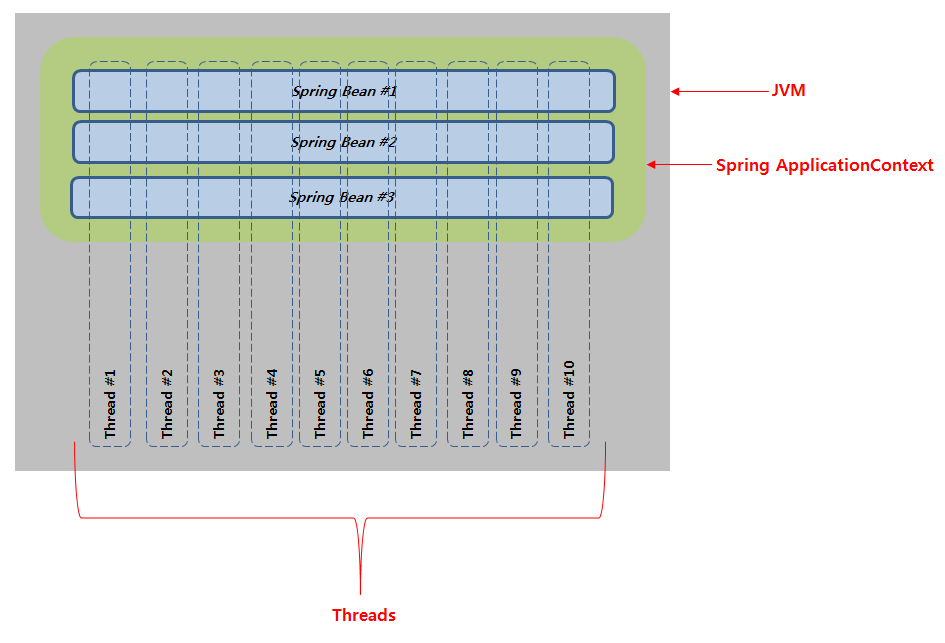
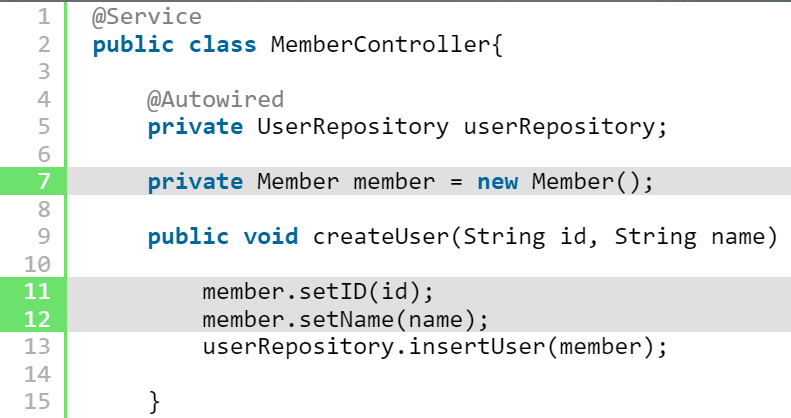
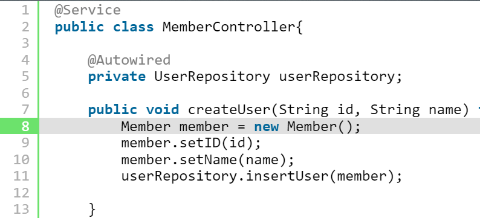
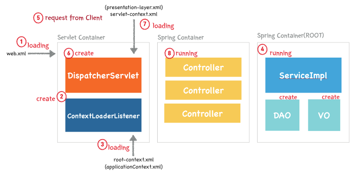

# 큐시즘 스프링 스터디 4 주차

날짜: 2022년 10월 1일

### ❓프로세스와 스레드는 각각 무엇이고, 둘의 차이는 무엇인가

**프로세스**

- 프로세스는 컴퓨터에서 연속적으로 실행중인 프로그램을 뜻한다.
- 운영체제로부터 자원(CPU시간, 주소공간, 메모리(코드,데이터,힙)영역등)을 할당 받는다.

**스레드**

- 프로세스 안에서 실행되는 여러 흐름 단위이다.즉 스레드는 프로세스에서 실행제어만 분리한 것이다.
- 프로세스로부터 자원(코드, 데이터, 힙영역을)을 할당 받는다. 따라서 스레드는 좀 더 효율적인 통신이 가능하고, 컨텍스트 스위칭이 빠르다.

- 컨텍스트 스위칭이란?
  Task중 다른 task로 전환하기 위해 사용하는 방법. 인터럽트가 발생하면 현재 프로세스의 상태를 PCB에 저장하고 새로운 프로세스를 로드 하는 것
  잦은 컨텍스트 스위칭은 성능저하를 일으킨다.

### ❓스프링은 멀티 스레딩 방식으로 동작하는데, 이들 간의 Thread-safe할 수 있는 이유는 무엇인가

Spring에서 components, service, controller등 모든 빈은 ApplicationContext에 싱글톤 패턴으로 객체가 생성된다.

객체가 1개인데 멀티 스레드 환경에서 thread-safe한가? **아니다 특정 상황에서만 safe하다**

특정상황 = **빈을 불변하게 한다.**

1. 생성자 주입
2. 빌더패턴 사용
3. 빈에 대해 setter 막아둔다.

빈은 무상태여야 하기 때문에 빈의 특정 상태를 나타내는 변수를 힙메모리에 상주시키면 안된다.

thread-unsafe

member가 계속 재사용 되기 때문에 멤버변수가 thread-safe하지 않다.

thread-safe

### ❓스프링 프로젝트를 실행 Run하면 그 시작점은 어디인가

1. 웹 어플리케이션이 실행되면 Tomcat은 web.xml을 로딩한다.
2. web.xml을 읽고 설정파일을 ContextLoaderListener 생성.
3. ContextLoaderListener가 root-context.xml을 로딩한다.
4. root-context.xml에 등록되어있는 Spring Container(root container)가 구동된다.
5. 클라이언트로부터 최초의 요청이 들어오면 Dispatcher Servlet을 생성한다.
6. Dispatcher Servlet은 WEB-INF/config폴더에 servlet-context.xml파일을 로딩하여 스프링 컨테이너를 구동한다. 이 떄 스프링 컨테이너가 Controller 객체를 메모리에 생성한다.
7. 이 후 Dispatcher Servlet의 작동 방식은 알고있으므로 생략한다.
