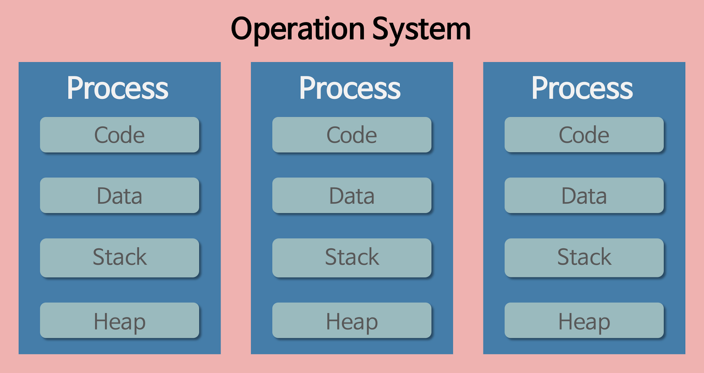
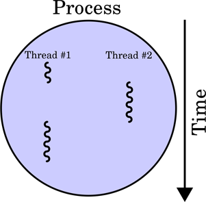
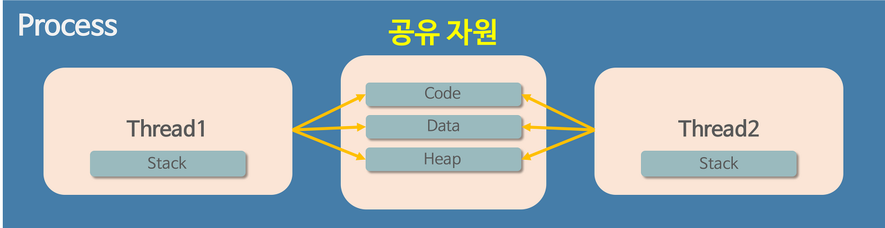
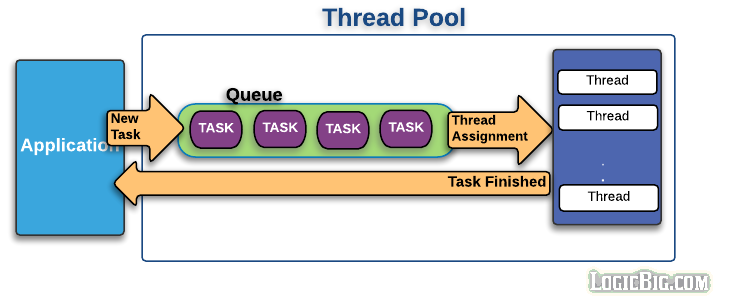
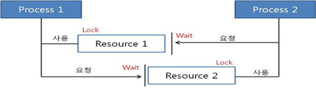
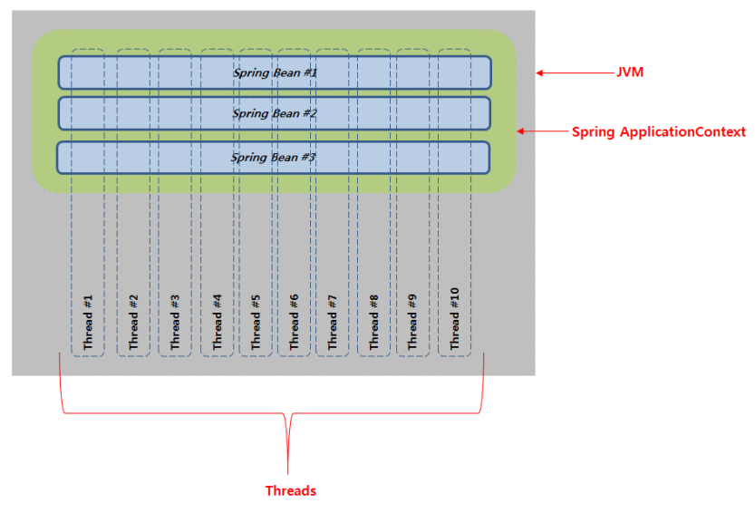
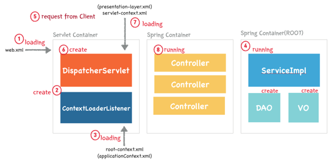

## 프로세스와 스레드는 각각 무엇이고, 둘의 차이는 무엇인가

<aside>
💡 프로그램은 뭘까?

</aside>

파일이 저장장치에 저장되어 있지만 **메모리에는 올라가있지 않은 정적인 상태.**

즉, 아직 실행되지 않은 파일 그 자체

.exe 파일 같이 사용자가 눌러서 실행하기 전의 파일을 말한다.

<aside>
💡 프로세스

</aside>



프로그램을 실행하면, 해당 파일은 컴퓨터 메모리에 올라가고 이 상태를 “동적인 상태”라고 한다. 이 상태의 프로그램을 프로세스 라고 한다. **운영체제가 관리하는 최소 작업 단위이다.**

🚀 **프로세스를 하나만 사용했을 때의 문제점**

과거에는 프로그램을 실행할 때 실행 시작부터 끝까지 프로세스 하나만을 사용해서 진행했다. 시간이 흐를 수록 프로그램이 복잡해지고 프로세스 하나만을 사용해서 프로그램을 실행하기에 벅차게 되었다.

*“하나의 프로그램을 처리하기 위한 여러가지 프로세스 만들면 되지 않을까?”*

운영체제는 안정성을 위해서 프로세스마다 자신에게 할당된 메모리 내부의 정보에만 접근할 수 있도록 제약을 두고 있고, 다른 프로세스에 접근하면 오류가 발생한다.

프로세스와는 다른 더 작은 실행단위의 개념이 필요하게 되었고 → “스레드”가 등장했다!



<aside>
💡 스레드

</aside>

스레드 간 **메모리를 공유하며 작동**한다. 스레드끼리 프로세스 자원을 공유하면서 프로세스 실행 흐름의 일부가 되는 것이다.  정확히는 **CPU 입장에서 최소 작업단위가 된다.**

스레드는 코드 내에 선언된 함수들이 되고, main함수 또한 일종의 스레드가 된다.

프로세스가 할당 받은 메모리 영역내에서 Stack 형식으로 할당된 메모리 영역은 따로 할당받고 , 나머지 Code/Data/Heap 형식으로 할당된 메모리 영역을 공유한다.

각각의 스레드는 별도의 스택을 갖고 있지만 힙 메모리는 서로 읽고 쓸 수 있다!


<aside>
💡 Thread Pool

</aside>

스레드가 생성될 때 os에서 메모리 공간 확보하고 → 메모리를 스레드에 할당해준다. 스레드는 동일한 메모리영역에서 생성되고 관리되지만 생성/수거에 드는 비용을 무시할 수 없다.

그래서 스레드를 미리 만들어 놓는 것이다!



요청을 작업큐에 넣고 → 미리 생성해 놓은 thread에 일감 할당 → 일을 다 처리한 Thread들은 다시 어플리케이션에 결과값 리턴

자바에서는 스레드풀을 생성하고 사용할 수 있도록 ExecutorService 인터페이스와 Executors  클래스를 제공하고 있다.

😀 Thread Pool의 장점

- 프로그램 성능저하 방지하기 위해

미리 스레드풀을 만들어서 스레드 생성/수거에 따르는 부담 완화

- 다수의 사용자 요청을 처리하기 위해

다수의 사용자 요청을 수용,빠르게 처리하고 대응하기 위해

🤯 Thread Pool의 단점

- 너무 많이 만들면 메모리 낭비 jam..
- 노는 스레드 발생

A,B,C 스레드가 있는데 A,B,C의 작업 소요 시간이 다른 경우가 생길 수 있다. 예를 들어 A스레드만 일이 많은 경우 B,C는 A가 일하는 것을 보고 놀고만 있게 됨.. (자바에서의 대안은 forkJoinPool이라고 한다. 자세한 내용은 [https://hamait.tistory.com/612](https://hamait.tistory.com/612))

[https://limkydev.tistory.com/55](https://limkydev.tistory.com/55)

<aside>
💡 프로세스가 강제 종료됐을때?

</aside>

프로세스를 실행하다가 오류가 발생해서 강제종료된다면

**프로세스**는 공유하고 있는 파일을 손상시키는 것이 아니라면 **다른 프로세스에게 영향을 주지 않는다!**

**스레드**는 code/data/heap 영역을 공유하기 때문에 어떤 스레드 하나에서 오류가 발생하면 **같은 프로세스 내의 다른 스레드가 모두 강제 종료된다.**

[https://velog.io/@raejoonee/프로세스와-스레드의-차이](https://velog.io/@raejoonee/%ED%94%84%EB%A1%9C%EC%84%B8%EC%8A%A4%EC%99%80-%EC%8A%A4%EB%A0%88%EB%93%9C%EC%9D%98-%EC%B0%A8%EC%9D%B4)

<aside>
💡 스레드를 직접 구현해보자!!

</aside>

Runnable 인터페이스를 구현하는 방법이 일반적

why? : 재사용성이 높고 코드의 일관성을 유지할 수 있어서 Thread보다 효율적이다.

## 스프링은 멀티 스레딩 방식으로 동작하는데, 이들 간의 Thread-safe할 수 있는 이유는 무엇인가

<aside>
💡 멀티 스레드

</aside>

하나의 프로세스가 여러 작업을 여러 스레드를 사용하여 동시에 처리하는 것

cf) 멀티 태스킹?

하나의 운영체제 안에서 여러 프로세스가 실행되는 것

---

😀 멀티 스레드의 장점

- context-switching 할 때 공유하고 있는 메모리 만큼의 메모리 자원을 아낄 수 있다.
- 스레드는 프로세스 내의 stack 영역을 제외한 모든 메모리를 공유하기 때문에 통신의 부담이 적어서 응답시간이 빠르다.

**cf) context-switching (컴시개)**

CPU가 하나의 프로세스를 실행하고 있는 상태에서 인터럽트 요청에 의해 다음 우선순위의 프로세스가 실행되어야 할 때 기존의 프로세스 상태또는 레지스터 값을 저장하고 cpu가 다음 프로세스 실행하도록 새로운 프로세스의 상태 또는 레지스터값으로 교체하는 작업을 의미.

자세한 내용은  [https://jeong-pro.tistory.com/93](https://jeong-pro.tistory.com/93)

🤯멀티 스레드의 단점

- 스레드 하나가 프로세스 내 자원을 망치면 모든 프로세스가 종료될 수 있다!
- 자원을 공유하기 때문에 동기화 문제가 발생할 수 밖에 없다.

**cf) 동기화 문제**

A 스레드가 x 라는 자원을 사용하다가 B 스레드로 제어권이 넘어간 후 B 스레드가 그 자원을 수정했을 때, 다시 제어권 받은 A 스레드가 x 라는 자원에 접근하지 못하거나, 바뀐 자원에 접근하게 되는 오류

<aside>
💡 스프링에서 멀티 스레딩

</aside>

우선 웹서버에서의 멀티스레드부터 이해해보자!

여러 클라이언트로 부터 요청이 날라왔을 때, 모든 사용자가 자신이 원하는 작업을 원활히 할 수 있는 이유는 “멀티 스레드” 때문.

만약 싱글 스레드라면 처음 요청을 보낸 사용자에게 응답을 보내기 전까진 다른 사용자들이 해당 서비스를 이용할 수 없을 것!

대부분의 웹서버는 멀티스레드를 이용한다고 하며 Spring의 Tomcat 도 이에 속함.

**cf) 싱글스레드인 웹서버도 있다!**

바로 Node.js(~~정말 자바스크립트는 뭘까…~~)

정확히 말하면 자바스크립트를 실행하는 스레드는 단 하나이므로 Node를 싱글스레드(이벤트 루프)라고 하는 것이고, node자체는 여러개의 스레드를 가지고 있다고 한다.

자세한 내용은  [https://medium.com/@gwakhyoeun/왜-node-js는-single-thread-인가-bb68434027a3](https://medium.com/@gwakhyoeun/%EC%99%9C-node-js%EB%8A%94-single-thread-%EC%9D%B8%EA%B0%80-bb68434027a3)

<aside>
💡 singleton

</aside>

지난 시간에 공부했던 singleton을 다시 생각해보자. Spring bean은 모두 싱글톤 패턴으로 제공이 된다고 공부했다. 이걸 스레드와 연결 시켜 생각해 본다면

만약 싱글톤 패턴을 사용하지 않는다면 수많은 사용자들로 인해 발생하는 요청을 멀티 스레드로 생성된 수많은 스레드가 처리하는 과정마다 필요한 객체를 생성해야할 것이다.

싱글톤을 통해 모든 사용자들의 Thread가 공유할 수 있게 만든 것이다!

[https://fbtmdwhd33.tistory.com/](https://fbtmdwhd33.tistory.com/)

<aside>
💡 Thread-safe?

</aside>

멀티 스레드 프로그래밍에서 함수나 변수 혹은 객체가 여러 스레드로 부터 동시에 접근이 이루여저도 프로그램 실행에 문제가 없음을 뜻한다.


위의 사진 처럼 여러 스레드가 한 리소스를 사용하려 할 때, 사용하려는 스레드 하나를 제외한 나머지 스레드들은 리소스를 사용하지 못하도록 막아야한다. → 이게 Thread-safe

<aside>
💡 동기화는 또 뭐죠..?

</aside>

스레드 동기화란 여러 스레드가 동일한 리소스를 공유하여 사용하게 되면 서로의 결과에 영향을 주기 때문에 이를 방지하는 기법이다.

방법 : 임계영역과 lock을 사용한다.

임계영역으로 설정한 구역은 동시에 리소스 사용할 수 없는 구역, lock을 획득한 스레드에 대해서만 리소스를 사용하도록 하는 방식.

[https://math-coding.tistory.com/174](https://math-coding.tistory.com/174)

**📌 질문**

정리하자면 동기화 과정을 통해 Thread-safe를 만들어 낼 수 있는 것 같은데 (이게 맞나요?!)

<aside>
💡 스프링이 Thread-safe 할 수 있는 이유?

</aside>



스프링은 기본적으로 Thread-safe하지 않은 환경이라고 한다.

근데 우리가 아는 Spring 사용 방법이 Thread-safe한 방법이라고 한다!

Thread의 특징을 다시 생각해보면 지역 변수를 저장하는 stack은 Thread 별로 할당되지만 전역변수를 저장하는 heap,code,data는 공유한다!

<aside>
💡 불변객체와 가변객체

</aside>

| 불변객체 | class의 instance가 생성된 시점부터 내부상태가 일정하게 유지되는 객체 .전역변수로 상태를 가지지 않고 지역변수를 통해 값을 변경하는 경우 (파라미터)  |
| --- | --- |
| 가변객체 | instance가 생성된 이후에도 내부 상태 변경이 가능한 객체!  전역변수를 가지고 Thread 별로 공유되는 객체의 전역변수를 변경할 수 있는 경우  |

스레드를 통해 가지고 있는 값을 변경시키고 출력하는 예제를 살펴보자.

💡 **불변객체**

```java
public class Singleton {

    private static Singleton singleton = new Singleton();

    private Singleton(){}

    public static Singleton getInstance(){
        return singleton;
    }

    public int add(int num){
        return ++ num;
    }

}

class AddTest {
    public static void main(String[] args) {
        Singleton singleton = Singleton.getInstance();

        int[] array = {0, 1, 2, 3, 4, 5, 6, 7, 8, 9, 10, 11, 12, 13, 14, 15, 16, 17, 18, 19};

        for (int i : array) {

            new Thread(() -> {
                System.out.println(singleton.add(i));
            }).start();

        }
    }

}
```

add 함수에서 외부로 받아온 변수 (파라미터)를 통해 값을 변화시켰다.



**💡 가변객체**

상태를 가지는(전역변수가 있는) 싱글톤 객체를 통해 덧셈을 실행해보자.

num이라는 전역변수를 주목해서 봐주세요~!

```java
public class Singleton {

    int num;

    private static Singleton singleton = new Singleton();

    private Singleton(){}

    public static Singleton getInstance(){
        return singleton;
    }

    public int add(){
				//여기서 num을 찍어본 결과 num이 0이여도 
				//singleton.add()를 했을 때 3이 나옴 어떻게 가능한거지??!
        return ++ num;
    }

}

class AddTest {
    public static void main(String[] args) {
        Singleton singleton = Singleton.getInstance();

        int[] array = {0, 1, 2, 3, 4, 5, 6, 7, 8, 9, 10, 11, 12, 13, 14, 15, 16, 17, 18, 19};

        for (int i : array) {

            new Thread(() -> {
                System.out.println(singleton.add());
            }).start();

        }
    }
}
```

하나의 공유자원을 놓고 여러개의 쓰레드가 읽기/쓰기를 하면 데이터 조작중 문제가 발생한다. → Thread-safe하지 못하다!

[https://alwayspr.tistory.com/11](https://alwayspr.tistory.com/11)

결론부터 말하자면 싱글톤 객체들이 불변객체로 활용되어 있어서 자연스레 Thread-safe한 환경을 만든 것이다.

스프링 빈(@Controller, @Service, @Repository, @Component 어노테이션이 달린 객체 등)의 전역변수에는 주로 스프링 빈과 같은 불변 객체들이 있지 VO, DTO, Map 같은 가변 객체가 존재하지 않기 때문이다.

## 스프링 프로젝트를 실행 Run하면 그 시작점은 어디인가


1. **Tomcat에 의해 web.xml로딩**

1. **web.xml에 등록되어 있는 ContextLoaderListener 생성**

→ ContextLoaderListener : ServletContextListener 인터페이스를 구현하고 있으며 ApplicationContext (빈의 생명주기 담당)생성

1. **ContextLoaderListenr가 root-context.xml로딩**

→ ContextLoaderListener가 서블릿 초기화하는 용도로 사용된다.

root-context.xml : **view**와 관련되지 않은 객체를 정의한다.

따라서 **Service**, **Repository(DAO)**, **DB**등 **비즈니스 로직**과 관련된 설정을 해준다.

1. **root-context.xml등록되어 있는 설정에 따라 Spring Container 구동**
2. **클라이언트로부터 Web Application에 요청**
3. **Dipatcher Servlet 생성**
4. **Dispatcher Servlet이 servlet-context.xml 로딩**

→ **요청**과 관련된 객체를 정의한다. url과 관련된 **controller**나, **@(어노테이션)**, **ViewResolver**, **Interceptor**, **MultipartResolver** 등의 설정을 해줍니다.

1. **두번째 Spring Container가 구동되며 응답에 맞는 PageController등이 동작**

[https://javannspring.tistory.com/231](https://javannspring.tistory.com/231)