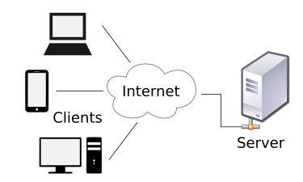

# 큐시즘 스프링 스터디 5주차

날짜: 2022년 10월 8일

### ❓Rest API는 무엇인가

REST아키텍처의 제약 조건을 준수하는 프로그래밍 인터페이스를 뜻한다.

**REST**

REpressentational State Transfer의 약자로 아키텍처 원칙 세트이다.

**API**

Application Programming Interface의 약자로 애플리케이션 소프트웨어를 구축하고 통합하는 정의 및 프로토콜 세트

REST API는 애플리케이션 소프트웨어를 구축하고 통합하는 프로토콜 세트 아키텍처 정도로 볼 수 있는데 몇가지 조건이 있다.

- Client-Server Architecture
클라이언트, 서버, 리소스로 구성되었으며 HTTP를 통해 관리되는 클라이언트-서버 아키텍처이다.
- Stateless
요청 간에 클라이언트 정보가 저장되지 않으며, 각 요청이 서로 연결되어있지 않다.
- Cacheable
클라이언트-서버 상호 작용을 간소화하는 캐시 가능 데이터
- Uniformed interface
정보가 표준 형식으로 전송되도록 하기 위한 구성 요소간 통합 인터페이스
    - 요청된 리소스는 식별 가능해야한다.
    - 클라이언트에 전송된 표현과 분리되어야 한다
    - 수신한 표현을 통해 클라이언트가 리소스를 조작할 수 있어야 한다.
    - 클라이언트에 반환되는 자기 기술적 메세지에 클라이언트가 어떻게 처리할지 설명하는 정보가 충분히 포함되어야한다
    - 클라이언트가 리소스에 액세스한 후 하이퍼링크를 사용해 현재 수행 가능한 모든 작업을 찾을 수 있어야 한다.
    
    즉 HTTP표준을 따르기만 한다면 어떠한 기술로든 API를 사용할 수 있어야 한다.
    
- Layered System
보안, 로드밸런싱등을 담당하는 서버를 클라이언트가 볼 수 없는 계층 구조로 체계화 한다.
- Code on demand
요청을 받으면 서버에서 클라이언트로 실행 가능한 코드를 전송하여 클라이언트 기능을 확장할 수 있다.

[https://meetup.toast.com/posts/92](https://meetup.toast.com/posts/92)

[https://senticoding.tistory.com/87](https://senticoding.tistory.com/87)

[https://m.blog.naver.com/azure0777/221066646741](https://m.blog.naver.com/azure0777/221066646741)

참고하면 좋은 블로그

### ❓스프링에서 Restful API 개발을 위해 지원하는 것은 무엇이 있고, 그 특징은 무엇인가

- @RestController
사용자가 정의한 클래스를 메서드의 리턴타입으로 사용할 수 있고 이를 JSON또는 XML로 자동처리 할 수 있다. @Controller + @ResponseBody느낌
- @ResponseBody
자바 객체를 http요청의 body내용으로 매핑하여 전송한다.
- @RequestBody
이 어노테이션이 붙은 파라미터에는 http요청의 body가 그대로 전달된다.
http body를 자바 객체로 변환해서 파라미터로 전달해준다.
- @PathVariable
url에 있는 값을 파라미터로 추출하려 할 때 사용한다.
ex) [http://localhost:8080/sample/**{sno}**/page/**{pno}](http://localhost:8080/sample/{sno}/page/{pno})** {}값을 변수로 처리 가능
- @CrossOrigin
웹 페이지의 제한된 자원을 외부 도메인에서의 접근을 허용하기 위함
[http://jmlim.github.io/spring/2018/12/11/spring-boot-crossorigin/](http://jmlim.github.io/spring/2018/12/11/spring-boot-crossorigin/)

### ❓클라이언트-서버 구조의 프로젝트 아키텍처를 그려보고, 데이터 흐름 설명하기

클라이언트가 서버를 통해 정보를 조회한다.

클라이언트와 서버는 웹에서 http프로토콜을 사용해서 통신한다.

클라이언트는 서버로 요청을 보내고, 서버는 요청에 따라 응답을 한다.

서버는 리소스 전달하는 역할만 하고 데이터베이스 서버를 따로 하나 두는 경우가 많아짐

### ❓HTTP 1.0 vs HTTP 2.0 vs HTTPS 각각의 차이는 무엇인가

**HTTP 1.0**

- 기본적으로 Connection 하나당 하나의 요청을 처리하도록 설계되어 있다.
- 동시에 여러개의 리소스를 주고받는 것이 불가능 하기 때문에 순차적으로 이루어진다. → 다수의 리소스를 처리할 때 latency가 생긴다.

- 이러한 특성 때문에 Head Of Line Blocking이 발생한다.
    
    첫 번째 패킷에 의해 지연될 때 발생하는 성능 저하 현상. 최악의 경우 패킷 드랍까지 발생.
    

- 이 외에도 TCP에서의 성능 지연, 무거운 header등 문제점이 많아 이를 개선하기 위해 여러가지 방법을 만들었다. 자세한건 이 [링크](https://seokbeomkim.github.io/posts/http1-http2/) 참고
- 그 방법중 알아야 할건 구글의 SPDY!
- SPDY는 http를 통한 전송을 재정의하여 고속화 하였다.

**HTTP 2.0**

- SPDY를 참고하여 HTTTP2가 탄생했다. 특히 Latency나 서버 사용량같은 성능 위주 개선이 이루어졌다.
- HTTP2는 Multiplexed Stream을 이용하여 한 Connection으로 동시에 여러개의 메세지를 주고 받을 수 있다.
- Stream Prioritization
Latency에 대비해 리소스간의 의존관계에 따른 우선순위를 설정하여 문제를 해결한다.
- Server Push
서버는 클라이언트가 요청하지 않은 리소스를 사전에 Push할 수 있다. Push된 리소스는 추후에 HTML문서를 요청할 때 사전에 받은 리소스로 인해 클라이언트의 요청을 최소화할 수 있다.
- Header Compression
클라이언트에서 중복된 요청을 검출해내고 중복하지 않은 정보만 전송한다.

**HTTPS(secure)**

HTTP를 암호화하는 방법으로 기본적으로 SSL/TLS을 사용하여 암호화된 형식으로 HTTP메세지를 래핑한다.

- SSL
    
    Secure Sockets Layer의 약자로 암호화 기반 인터넷 보안 프로토콜을 뜻한다.
    
    전달되는 모든 데이터를 암호화하고 특정 유형의 공격도 차단한다. SSL은 TLS 암호화의 전신이기도 하다.
    

- TLS
    
    Transport Layer Security의 약자로 SSL의 업데이트 버전이라고 생각하면 편하다.
    
    데이터를 암후화하고 handshake을 통해 인증이 이루어진다. 또한 데이터 무결성을 위해 데이터에 디지털 서명을 하여 데이터가 도착 전에 조작된지 확인한다.
    

결론!

- http1.0과 http2.0의 가장 큰 차이점은 한 Connection에서 몇개의 메세지를 주고받을 수 있는지이다. 그 외에도 성능 위주의 개선을 보완한 것이 http2.0이라 볼 수 있다.

- http1.0과 http2.0을 https와 비교하기는 어렵다고 생각한다. https는 https에 여러가지 방법으로 암호화를 추가한 것이다.