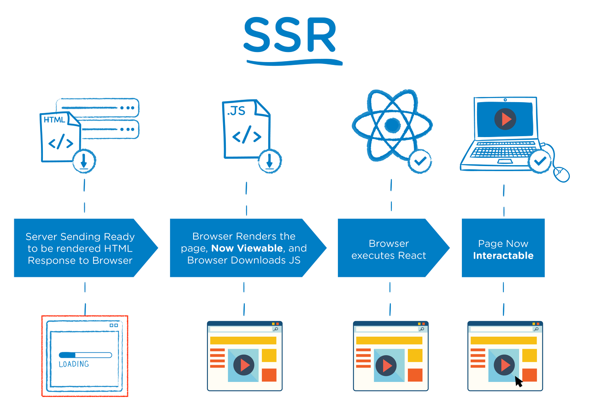
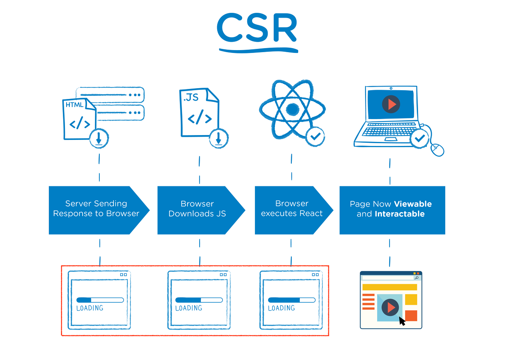
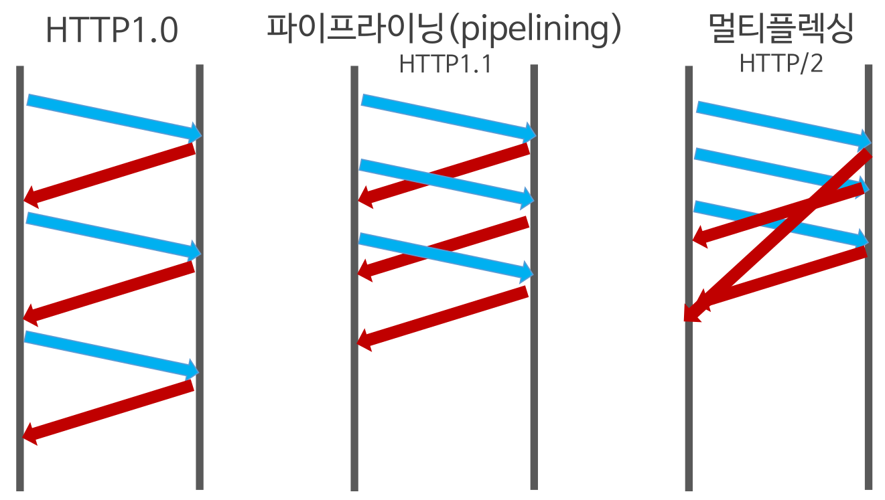
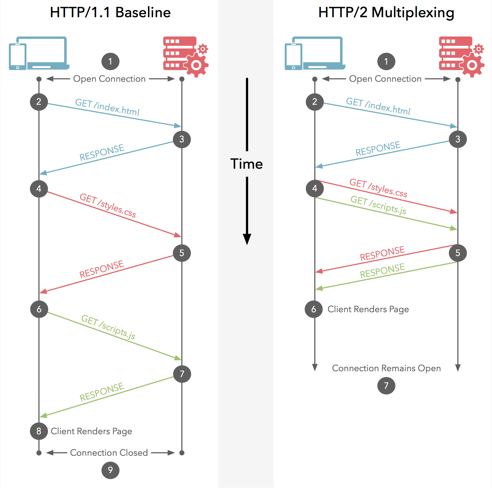
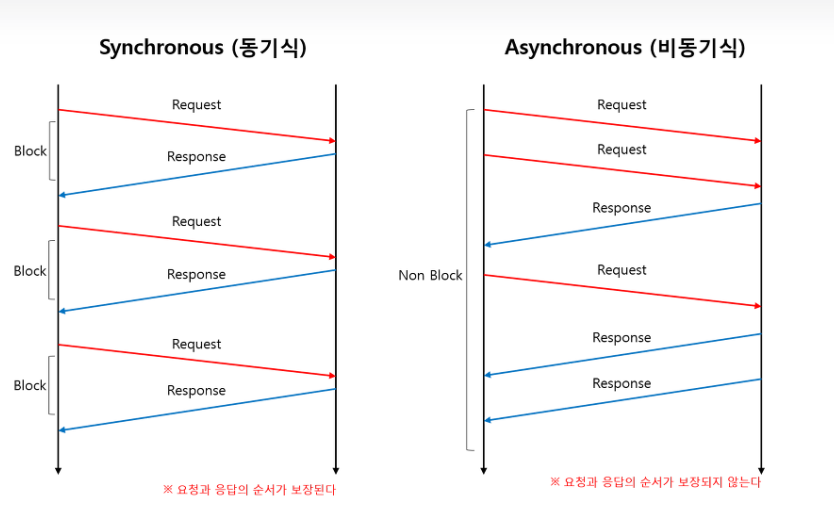
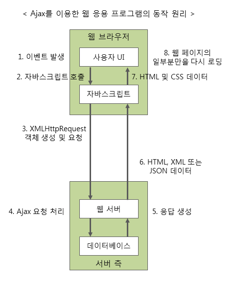
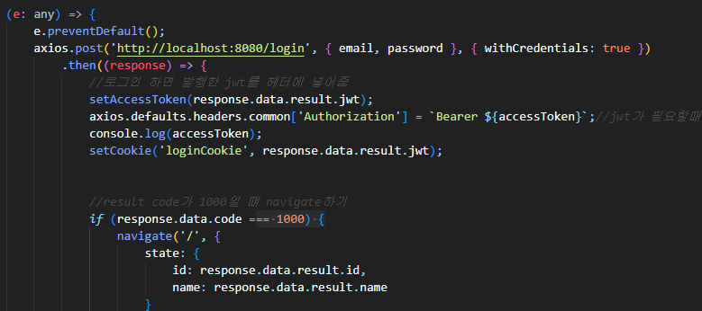
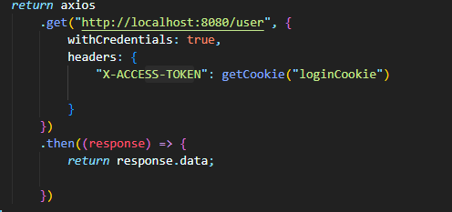

## Rest API는 무엇인가

### REST?

Representational State Transfer의 약자이다.

- URI를 통해 자원을 **이름**(자원의 표현)으로 구분하여 해당 자원의 **상태(**정보)를 주고 받는 것을 의미한다.
- 웹 기존 기술과 HTTP 프로토콜을 그대로 활용하기 때문에 웹의 장점을 최대한 활용할 수 있는 아키텍쳐 스타일이다.
- REST는 네트워크 상에서 Client와 Server 사이의 통신 방식중 하나이다.
- RESTful한 API를 구현하는 근본적인 목적이 성능 향상에 있는 것이 아니라 일관적인 컨벤션을 통한 API의 이해도 및 호환성을 높이는 것이 주 동기이니, 성능이 중요한 상황에서는 굳이 RESTful한 API를 구현할 필요는 없다.

### REST의 CRUD Operation

Create : 생성 [POST]

Read : 조회 [GET]

Update : 수정 [PUT]

Delete: 삭제 [DELETE]

HEAD: header 정보조회 [HEAD]

### REST 구성요소

1. **자원 (URI)**
- 모든 자원에 고유한 ID가 존재하고 이 자원은 Server에 존재한다.
- client는 URI를 이용해서 자원을 지정하고 해당 자원의 상태(정보)에 대한 조작을 Server에 요청한다.

1. **행위(Verb) : HTTP Method**
- HTTP 프로토콜의 Method를 사용한다.

1. **표현 (Representation of Resource)**
- 클라이언트가 자원의 상태(정보)에 대한 조작을 요청하면 Server는 이에 적절한 응답(Representation)을 보낸다.
- REST에서 하나의 자원은 JSON,XML,TEST 등 여러 형태의 Representation으로 나타내어질 수 있다.
- JSON 혹은 XML을 통해 데이터 주고 받는다.

### REST의 장단점

### 😀 장점

- HTTP 프로토콜의 인프라를 그대로 사용하므로 REST API 사용을 위한 별도의 인프라를 구출할 필요가 없다.
- HTTP 표준 프로토콜에 따르는 모든 플랫폼에서 사용이 가능하다.
- HTTP 표준 프로토콜에 따르는 모든 플랫폼에서 사용이 가능하다.
- REST API 메시지가 의도하는 바를 명확하게 나타내므로 의도하는 바를 쉽게 파악할 수 있다.

### 😮‍💨 단점

- 사용할 수 있는 메소드가 4가지 밖에 없다.
- 브라우저를 통해 테스트 할 일이 많은 서비스라면 쉽게 고칠 수 있는 URL보다 Header의 값이 더 어렵게 느껴진다.
- 구형 브라우저가 아직 지원해주지 못하는 부분이 존재한다.

→ PUT,DELETE 사용 못함

### 📌 질문: 동사는 사용하면 안되는걸까?

REST API에서 명사를 사용하고 동사는 사용하지 말라고 하는데

login ,logout 같은 동사를 URI에 명시하곤 한다. 동사는 정말 사용하면 안되는 걸까? 분명 스프링부트 강의 보면 login,logout 쓰는 것 같던데.. 다들 어떻게 쓰는지 궁금해요!!

우선 찾아본 바로는 컨트롤 자원을 의미하는 경우는 예외적으로 동사를 허용한다고 한다.

```
// Bad
http://restapi.example.com/posts/duplicating

// Good
http://restapi.example.com/posts/duplicate
```

관련 stack overflow 글

[https://stackoverflow.com/questions/7140074/restfully-design-login-or-register-resources](https://stackoverflow.com/questions/7140074/restfully-design-login-or-register-resources)

```
GET  /logout   // destroys session and redirects to /
GET  /login    // gets the webpage that has the login form
POST /login    // authenticates credentials against database and either redirects home with a new session or redirects back to /login
GET  /register // gets the webpage that has the registration form
POST /register // records the entered information into database as a new /user/xxx
GET  /user/xxx // gets and renders current user data in a profile view
POST /user/xxx // updates new information about use
```

위의 URI를

```
GET    /session/new gets the webpage that has the login form
POST   /session authenticates credentials against database
DELETE /session destroys session and redirect to /
GET  /users/new gets the webpage that has the registration form
POST /users records the entered information into database as a new /user/xxx
GET  /users/xxx // gets and renders current user data in a profile view
POST /users/xxx // updates new information about user
```

아래와 같이 표현해야한다는 답변이였다.

**cf) 명사로 Resource를 표현하는 이유**

명사는 해당 Resource의 속성을 표현할 수 있지만 동사는 그렇지 못하기에 명사로 표현하라고 하는 것이다!

**REF**

[https://gmlwjd9405.github.io/2018/09/21/rest-and-restful.html](https://gmlwjd9405.github.io/2018/09/21/rest-and-restful.html)

## 스프링에서 Restful API 개발을 위해 지원하는 것은 무엇이 있고, 그 특징은 무엇인가

### @RestController

- 스프링 4.0버전 이상부터 지원
- @Controller + @ResposneBody
- RestController 어노테이션을 붙인 컨트롤러 클래스 하위 메서드에 @ResponseBody 어노테이션 없이 JSON 전송가능
- @Controller만 하게 된다면 ResponseBody 없이 문자열,MAP 반환 불가

### **@ResponseStatus**

- 부여된 메서드의 응답 상태코드를 지정할 수 있다 (200이면 성공)

### RestTemplate

- 스프링 3.0 버전 이상부터 지원
- RESTful 하게 HTTP 통신을 통해 json, xml 응답을 쉽게 받을 수 있음
- 동기 방식의 REST Client : REST API 호출 이후 응답을 받을 때까지 기다림
- import org.springframework.http.client.restTemplate;
- HTTPClient : HTTP를 사용하여 통신하는 범용 라이브러리 → RestTemplate가 HttpClient를 추상화해서 제공

## 클라이언트-서버 구조의 프로젝트 아키텍처를 그려보고, 데이터 흐름 설명하기 (SSR,CSR)

### SSR

한줄정리: 데이터까지 전부 삽입되어 완성된 html받아온다.

서버쪽에서 렌더링 준비를 끝마친 상태로 클라이언트에 전달하는 방식이다.




1. user가 웹사이트 요청을 보낸다.
2. 서버는 즉시 렌더링 가능한 html파일을 만든다.
3. 클라이언트에 전달되는 순간 이미 렌더링 준비가 되어있기에 html은 즉시 렌더링 된다. 사이트 자체는 조작이 불가능하다(JS가 읽기 전)
4. 클라이언트가 js 다운받는다.
5. 다운 받는 중에 유저는 컨텐츠를 볼 수 있지만 사이트 조작은 불가능하다. 이때 사용자 조작은 기억하고 있는다.
6. 브라우저가 js프레임워크를 실행한다.
7. js까지 성공적으로 컴파일 되면 기억하고 있던 사용자 조작이 실행되고 웹페이지는 상호작용 가능해진다.

### CSR

한줄정리 : 데이터가 없는 **빈 깡통인 html만** 받아오고 데이터는 깡통인 문서와 여러 static 파일이 로드된 이후 요청해서 받아온다.

- 렌더링이 클라이언트 쪽에서 일어난다.
- 서버가 요청을 받으면 클라이언트에 HTML과 JS를 보내주고, 클라이언트는 그것을 받아 렌더링을 시작한다.



1. USER가 웹사이트 요청을 보낸다.
2. CDN(엔드유저의 요청에 물리적으로 가까운 서버에서 요청에 응답하는 방식)이 HTML과 JS로 접근할 수 있는 링크를 클라이언트로 보낸다.
3. 클라이언트 HTML과 JS를 다운받는다

**💥 ISSUE**

이때 SSR과 달리 유저는 아무것도 볼 수 없다.

1. 다운 완료된 JS가 실행된다. 데이터를 위한 API가 호출된다.
2. 서버가 API로부터의 요청에 응답한다.
3. API로 부터 받아온 데이터를 placeholder 자리에 넣어준다.

→ 페이지는 상호작용이 가능해진다.

### SPA?

Single Page Application으로 서버로부터 처음 페이지를 받아오고 (SSR) 이후에는 동적으로 페이지 구성해서 새로운 페이지 받아오지 않는 웹애플리케이션을 뜻한다.

초기에만 SSR을 하고 이후에 CSR진행!

페이지가 한번 로딩된 이후 **데이터를 수정하거나 조회할 때 페이지가 새로고침되지 않고 다른 페이지로 넘어가지 않는다.**

대표적으로 리액트가 SPA이다!

### SSR을 사용해야하는 경우

- 네트워크가 느릴 때
- SEO(검색 엔진 최적화)가 필요할때
- 웹 사이트 상호작용이 별로 없을 때

### CSR을 사용해야하는 경우

- 네트워크가 빠를때
- 서버의 성능이 좋지 않을 때
- 사용자에게 보여줘야하는 데이터의 양이 많을 때 (로딩창을 띄울 수 있는 장점!)
- 웹 어플리케이션에 사용자와 상호작용할 것들이 많을 때

**REF**

[https://proglish.tistory.com/216](https://proglish.tistory.com/216)

[https://blog.hahus.kr/csr-ssr-spa-mpa-ede7b55c5f6f](https://blog.hahus.kr/csr-ssr-spa-mpa-ede7b55c5f6f)

## HTTP 1.0 vs HTTP 2.0 vs HTTPS 각각의 차이는 무엇인가

### HTTP 1.0

- HTTP 1.0은 기본적으로 Connection 당 하나의 요청을 처리
- 동시전송은 불가능하고 하나의 요청에 대한 응답이 온 후 다음 요청을 처리
- 수 많은 멀티미디어 리소스들이 있는 상황에서 이러한 특징은 Network Latency를 발생시킵니다.

### HTTP 1.1

- 데이터는 문자열로 전송
- 연결당 하나의 요청과 응답처리 (동시전송 문제/ 다수의 리소스 처리하기에 속도와 성능의 문제 가짐)
- 무거운 header(수많은 http 요청이 발생하는데 이 요청들의 header정보는 대부분 동일하다. 근데 HTTP 1.1은 이런 헤더를 중복해서 보낼 뿐 아니라 cookie 정보 역시 매 요청마다 헤더에 포함하여 전송)
- HTTP Pipelining 도입으로 TCP 안에 두 개 이상의 HTTP 요청을 담아 Network Latency을 줄이는 방식 채택 (HTTP 1.0의 단점 보완위함)

→ 그러나!! 이는 정확히 구현하기 힘들 뿐 아니라 HOL Blocking 발생

### HOL Blocking

- 특정응답 지연
- 네트워크에서 같은 큐에 있는 패킷이 첫번째 패킷에 의해 지연될 때 발생하는 성능저하 현상을 의미한다.
- 만약 HTTP Pipelining을 통해 한번에 여러개 이미지를 요청한다면 가장 앞에 이미지의 응답이 지연되면 두번째 세번째 이미지도 지연이 발생
- **완료된 응답부터 보내면 되지 않을까 싶지만 서버는 TCP 요청 받은 순서대로 응답해야함**




### HTTP 2.0

- 데이터는 바이너리로 인코딩하여 압축해서 전송한다.
- Multiplexed Streams 방식이 도입되어 한번의 연결으로 여러개의 메세지를 동시에 주고 받을 수 있다. 그러므로 HOL-Blocking이 발생하지 않는다.
- Stream Prioritization : 요청 리소스간 우선순위를 설정하여 응답을 빨리 받을 수 있다.
- Header Compression : 헤더 정보를 *HPACK 압축 방식을 이용하여 압축 전송한다.
- Server Push : 클라이언트 요청 없이 서버에서 리소스를 보내줄 수 있다.

cf) HPACK

클라이언트와 서버는 각각 Header Table을 관리하고 이전 요청과 동일한 필드는 table의 index만 보내고, 변경되는 값은 Huffman Encoding 후 보냄으로서 Header의 크기를 경령화하였다.

### 📌 RECAP

| HTTP 1.1 | 한 연결당 하나의 요청과 응답을 처리하여 느리고, 동시전송 문제를 겪는다. 요청시 매번 헤더에 쿠키를 포함하여 무겁고 중복된 헤더 값을 전송한다. |
| --- | --- |
| HTTP 2.0 | 한 연결당 여러개의 요청과 응답을 동시에 처리하여 빠르다. 헤더 값의 중복을 최소화하고 가볍다. |

**REF**

[https://velog.io/@goblin820/HTTP-1.0-vs-HTTP-2.0](https://velog.io/@goblin820/HTTP-1.0-vs-HTTP-2.0)

[https://ssungkang.tistory.com/entry/네트워크-HTTP-11-VS-HTTP-20](https://ssungkang.tistory.com/entry/%EB%84%A4%ED%8A%B8%EC%9B%8C%ED%81%AC-HTTP-11-VS-HTTP-20)

### HTTPS

인터넷 상에서 정보를 암호화하는 ssl 프로토콜을 이용하여 웹브라우저와 서버가 데이터를 주고 받는 통신규약

- http메세지(text)를 암호화하는 것이다.
- HTTPS의 S가 Secure Socket, 보안통신망을 말한다.
- HTTPS의 암호화 원리는 공개키 암호화 방식!

REF

[https://jeong-pro.tistory.com/89](https://jeong-pro.tistory.com/89)

## 번외_  프론트엔드는 백엔드와 비동기 통신을 한다?!



### 동기식통신

- 동시에 일어난다
- Request를 보내게 된다면 얼마나 시간이 걸리든 그 자리에서 Response를 받는다는 말
- 서버 사이에 Transaction을 맞추겠다

Request를 보내면 Response를 기다린다는 말은 Request를 보낸 Thread는 Response가 도착하기 전까진 아무것도 못하는 Block상태

→ 뒤에 들어오는 요청들은 Connection이 가능한 Thread가 없어 연결을 맺지 못하는 성능적 이슈발생

### 비동기식 통신

- Request를 보내더라도 Response를 언제 받아도 상관이 없다는 말
- Response를 기다리지 않고 다른 일을 하는 상태를 Non Block 상태
- Thread가 Response를 받지 않고 여러가지 요청 보냈을때 뒤에 보낸 요청이 먼저 처리가 되었다면 뒤에 요청값에 대한 응답값이 먼저 올 수도 있다.
- **Async(비동기식) 통신은 순서를 보장 하지 않는다.**

## AJAX? AXIOS?

### AJAX

- 자바스크립트 라이브러리 중 하나
- 자바스크립트를 통해 서버에 데이터 요청
- 비동기성!!

### AJAX의 특징

- 페이지 새로고침 없이 서버에 요청
- 서버로부터 데이터 받고 작업 수행

### AJAX의 진행과정



1. XMLHttpRequestObject를 만든다
- request 보낼 준비를 브라우저에 시키는 과정

1. call back 함수를 만든다
- 서버에서 response 왔을 때 실행시키는 함수 , HTML 업데이트

1. Open a request
- 서버에서 response왔을 때 실행시키는 함수, HTML 업데이트

1. Send the request

### AXIOS

- 브라우저와 Node js를 위한 Promise API를 활용하는 HTTP 비동기 통신 라이브러리이다.
- 백엔드와 통신을 쉽게 하기 위해 AJAX와 더불어 사용한다.
- 프레임워크에서 AJAX 구현할 때 AXIOS쓴다!

cf) Fetch보다 Axios가 API 달기 훨씬 편하다~~

### AXIOS의 특징

- 운영환경에 따라 XMLHttpRequest 객체 또는 Node.js의 http API 사용
- Promise(ES6) API 사용
- 요청과 응답 데이터의 변형
- HTTP 요청 취소
- HTTP 요청과 응답을 JSON 형태로 자동 변경

### AXIOS 사용예시

**[POST]**



**[GET]**



**REF**

[https://inpa.tistory.com/entry/WEB-🌐-비동기Async통신-동기Sync통신](https://inpa.tistory.com/entry/WEB-%F0%9F%8C%90-%EB%B9%84%EB%8F%99%EA%B8%B0Async%ED%86%B5%EC%8B%A0-%EB%8F%99%EA%B8%B0Sync%ED%86%B5%EC%8B%A0)

[https://99geo.tistory.com/65](https://99geo.tistory.com/65)

## 프론트에서 서버의 상태를 관리할 수 있는 방법? React-query

### 프론트엔드에게 State란?

프론트엔드는 대부분 상태관리에 엄청난 공을 들이면서 개발을 한다!

state가 변경되면 렌더링에 영향을 주기 때문!

컴포넌트에서 동적인 값을 상태라고 생각하면 된다.

### 프론트엔드가 서버와 통신하면서 state 관리에 생기는 문제점

1. 보통 상태관리는 Redux라는 라이브러리를 통해서 전역 상태관리를 진행한다. 근데 서버데이터를 활용하려면 Redux라이브러리가 아닌  Redux-saga Redux-Thunk 같은 **미들웨어를 사용해야한다.** (왜냐면 Redux가 서버 상태작업에는 그리 좋지 않기때문)

1. API를 통해 서버로부터 값을 가져오거나 업데이트 하는 코드를 짜다보면 **클라이언트 데이터와 서버데이터가 공존하게 된다.**

서버와 클라이언트 데이터를 분리해서 상태관리를 하자

→ React-query!

**cf) 서버상태와 클라이언트 상태의 차이점**

서버 상태는 db에 저장된 데이터, 클라이언트 상태는 컴포넌트에서 관리하는 input값이라고 생각하면 된다!

### React-Query

- 서버상태의 동기화를 편하게 진행해준다.
- 캐싱 (API 콜을 줄여서 서버에 대한 부담 줄여줌)
- GET한 데이터에 대해 UPDATE하면 다시 GET 수행

→ 예를 들어 게시판 조회하는데 동시에 글을 생성하면 자동으로 GET하는 API 실행

- 동일 데이터에 여러번 요청하면 한번만 요청함

### 사용예시

```jsx
const { isLoading, error, data } = useQuery("getUsers", () => {
        return axios
            .get("http://localhost:8080/user", {
                withCredentials: true,
                headers: {
                    "X-ACCESS-TOKEN": getCookie("loginCookie")

                }
            })
            .then((response) => {
                return response.data;

            })
    });

    if (!data) {
        return <h1>로딩중</h1>
    }
```

### 🚀 **참고하면 좋은 유튜브**

[https://www.youtube.com/watch?v=SYXvHXOJzwc&list=PLpPqplz6dKxW5ZfERUPoYTtNUNvrEebAR&index=10](https://www.youtube.com/watch?v=SYXvHXOJzwc&list=PLpPqplz6dKxW5ZfERUPoYTtNUNvrEebAR&index=10)

REF

[https://kyounghwan01.github.io/blog/React/react-query/basic/#사용하는-이유](https://kyounghwan01.github.io/blog/React/react-query/basic/#%E1%84%89%E1%85%A1%E1%84%8B%E1%85%AD%E1%86%BC%E1%84%92%E1%85%A1%E1%84%82%E1%85%B3%E1%86%AB-%E1%84%8B%E1%85%B5%E1%84%8B%E1%85%B2)

[https://tech.osci.kr/2022/07/13/react-query/](https://tech.osci.kr/2022/07/13/react-query/)

## 📌 질문

(번외) get api 만드는 중인데 dto를 따로 설계 해주는 중

이건 정적 팩토리 메서드인지 빌더인지

둘의 차이점은 뭔지…? ㅜㅜ

